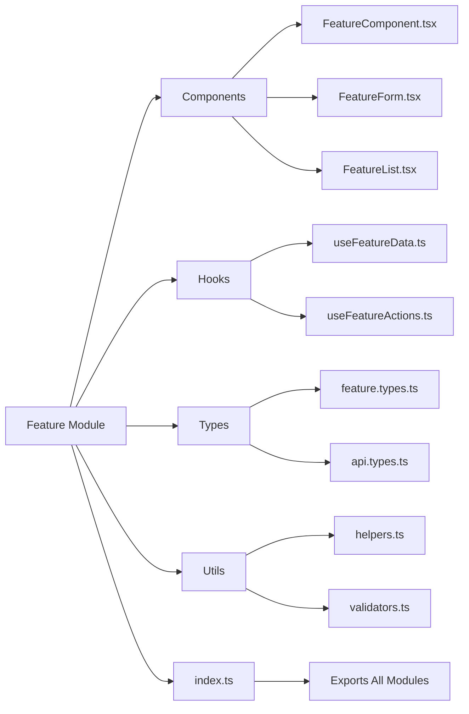

# ThinkChrist Note Sharing Platform - Think notes, ThinkChrist

A community-driven platform for Christ University students to share and discover academic resources, built with a modular architecture for scalability and maintainability.

## Features

- 📚 **Smart Resource Repository** - Upload and download notes, papers, and study materials
- 🏆 **Gamification System** - Earn points and badges for contributions
- 👥 **Community Driven** - Upvote/downvote system for quality control
- 🔍 **Advanced Search** - Filter by department, semester, subject, and more
- 📊 **Leaderboards** - Track top contributors
- 🌓 **Dark Mode** - Toggle between light and dark themes
- 🔔 **Smart Notifications** - Stay updated with relevant activities
- 📈 **Analytics Dashboard** - Track usage and performance metrics
- 👨‍💼 **Admin Panel** - Comprehensive administration tools

## Tech Stack

- **Framework**: Next.js 14 (App Router)
- **Language**: TypeScript
- **Styling**: Tailwind CSS
- **Database**: Supabase (PostgreSQL)
- **Authentication**: Supabase Auth
- **File Storage**: Supabase Storage
- **Hosting**: Vercel
- **Architecture**: Feature-based modular design

## Getting Started

### Prerequisites

- Node.js 18+ and npm
- Supabase account
- Christ University email (@christuniversity.in)

### Installation

1. Clone the repository:
```bash
git clone https://github.com/yourusername/christ-uniconnect.git
cd christ-uniconnect
```

2. Install dependencies:
```bash
npm install
```

3. Set up environment variables:
```bash
cp .env.local.example .env.local
```

4. Update `.env.local` with your Supabase credentials:
```
NEXT_PUBLIC_SUPABASE_URL=your_supabase_url
NEXT_PUBLIC_SUPABASE_ANON_KEY=your_supabase_anon_key
SUPABASE_SERVICE_ROLE_KEY=your_service_role_key
```

5. Run database migrations:
```bash
npm run setup-db
```

6. Start the development server:
```bash
npm run dev
```

Open [http://localhost:3000](http://localhost:3000) to view the application.

## Project Structure

The project follows a **feature-based modular architecture** that promotes scalability, maintainability, and team collaboration:

```
christ-uniconnect/
├── src/
│   ├── app/                    # Next.js App Router (routes only)
│   │   ├── (auth)/            # Auth route group
│   │   ├── (dashboard)/       # Dashboard route group
│   │   ├── admin/             # Admin routes
│   │   ├── api/               # API routes (organized by feature)
│   │   │   ├── auth/          # Authentication endpoints
│   │   │   ├── resources/     # Resource management endpoints
│   │   │   ├── users/         # User management endpoints
│   │   │   ├── gamification/  # Gamification endpoints
│   │   │   └── notifications/ # Notification endpoints
│   │   ├── globals.css
│   │   ├── layout.tsx
│   │   └── page.tsx
│   ├── features/              # Feature modules (self-contained)
│   │   ├── auth/              # Authentication feature
│   │   │   ├── components/    # Auth-specific components
│   │   │   ├── hooks/         # Auth-specific hooks
│   │   │   ├── types/         # Auth-specific types
│   │   │   ├── utils/         # Auth-specific utilities
│   │   │   └── index.ts       # Feature exports
│   │   ├── resources/         # Resource management feature
│   │   ├── gamification/      # Gamification feature
│   │   ├── user-management/   # User management feature
│   │   ├── notifications/     # Notifications feature
│   │   ├── analytics/         # Analytics feature
│   │   ├── admin/             # Admin feature
│   │   └── dashboard/         # Dashboard feature
│   ├── shared/                # Shared across features
│   │   ├── components/        # Reusable UI components
│   │   │   ├── ui/            # Base UI components (Button, Input, etc.)
│   │   │   ├── layout/        # Layout components (Header, Sidebar)
│   │   │   └── common/        # Common business components
│   │   ├── hooks/             # Shared custom hooks
│   │   ├── utils/             # Utility functions
│   │   ├── types/             # Global type definitions
│   │   ├── constants/         # Application constants
│   │   └── config/            # Configuration files
│   ├── lib/                   # External service integrations
│   │   ├── supabase/          # Supabase client and utilities
│   │   ├── services/          # External service integrations
│   │   └── utils/             # Library utilities
│   └── middleware.ts          # Next.js middleware
├── supabase/                  # Database migrations and seeds
├── public/                    # Static assets
├── scripts/                   # Utility scripts
└── .kiro/                     # Kiro configuration and specs
    └── specs/                 # Feature specifications
```

### Architecture Principles

1. **Feature Isolation**: Each feature is self-contained with its own components, hooks, types, and utilities
2. **Shared Resources**: Common functionality is centralized in the `shared/` directory
3. **Clean Separation**: Clear boundaries between features, shared code, and infrastructure
4. **Scalable Structure**: Easy addition of new features without affecting existing ones

### Project Structure Diagram

```mermaid
graph TD
    A[ThinkChrist Platform] --> B[Frontend - Next.js 14]
    A --> C[Backend - Supabase]
    A --> D[Deployment - Vercel]
    
    B --> E[App Router]
    B --> F[Features]
    B --> G[Shared]
    B --> H[Lib]
    
    E --> E1[Routes]
    E --> E2[API Endpoints]
    E --> E3[Layouts]
    
    F --> F1[Auth]
    F --> F2[Resources]
    F --> F3[Gamification]
    F --> F4[User Management]
    F --> F5[Notifications]
    F --> F6[Analytics]
    F --> F7[Admin]
    F --> F8[Dashboard]
    
    F1 --> F1A[Components]
    F1 --> F1B[Hooks]
    F1 --> F1C[Types]
    F1 --> F1D[Utils]
    
    G --> G1[UI Components]
    G --> G2[Layout Components]
    G --> G3[Common Components]
    G --> G4[Shared Hooks]
    G --> G5[Utilities]
    G --> G6[Types]
    
    H --> H1[Supabase Client]
    H --> H2[Services]
    H --> H3[Middleware]
    
    C --> C1[PostgreSQL Database]
    C --> C2[Authentication]
    C --> C3[File Storage]
    C --> C4[Real-time]
    
    D --> D1[Static Generation]
    D --> D2[API Functions]
    D --> D3[Edge Runtime]
```



### Feature Module Structure



## Modular Architecture Guide

### Understanding the Feature-Based Structure

Each feature module follows a consistent pattern that promotes maintainability and reusability:

```typescript
// features/[feature-name]/
├── components/           # Feature-specific React components
│   ├── FeatureComponent.tsx
│   ├── FeatureForm.tsx
│   └── index.ts         # Export all components
├── hooks/               # Feature-specific custom hooks
│   ├── useFeatureData.ts
│   ├── useFeatureActions.ts
│   └── index.ts         # Export all hooks
├── types/               # Feature-specific TypeScript types
│   ├── feature.types.ts
│   └── index.ts         # Export all types
├── utils/               # Feature-specific utility functions
│   ├── featureHelpers.ts
│   └── index.ts         # Export all utilities
└── index.ts             # Main feature export file
```

### Adding a New Feature

Follow these steps to add a new feature while maintaining the modular architecture:

#### 1. Create Feature Directory Structure

```bash
mkdir -p src/features/your-feature/{components,hooks,types,utils}
```

#### 2. Set Up Feature Exports

Create `src/features/your-feature/index.ts`:
```typescript
// Export all feature modules
export * from './components'
export * from './hooks'
export * from './types'
export * from './utils'
```

#### 3. Create Component Index

Create `src/features/your-feature/components/index.ts`:
```typescript
export { default as YourFeatureComponent } from './YourFeatureComponent'
export { default as YourFeatureForm } from './YourFeatureForm'
// Export other components...
```

#### 4. Create Hooks Index

Create `src/features/your-feature/hooks/index.ts`:
```typescript
export { useYourFeatureData } from './useYourFeatureData'
export { useYourFeatureActions } from './useYourFeatureActions'
// Export other hooks...
```

#### 5. Create Types Index

Create `src/features/your-feature/types/index.ts`:
```typescript
export interface YourFeatureData {
  id: string
  name: string
  // ... other properties
}

export interface YourFeatureFilters {
  category?: string
  status?: string
  // ... other filters
}
```

#### 6. Create Utils Index

Create `src/features/your-feature/utils/index.ts`:
```typescript
export const formatYourFeatureData = (data: any) => {
  // Utility function implementation
}

export const validateYourFeatureInput = (input: any) => {
  // Validation logic
}
```

#### 7. Add API Routes (if needed)

Create API routes following the feature structure:
```
src/app/api/your-feature/
├── route.ts              # GET, POST endpoints
├── [id]/route.ts         # GET, PUT, DELETE by ID
└── specific-action/route.ts  # Specific feature actions
```

#### 8. Update Main Feature Index

Add your feature to `src/features/index.ts`:
```typescript
export * from './your-feature'
// ... other feature exports
```

### Best Practices

#### Component Organization
- Keep components small and focused on a single responsibility
- Use shared UI components from `shared/components/ui/`
- Place feature-specific components in the feature's `components/` directory

#### Hook Guidelines
- Create custom hooks for complex state logic
- Use shared hooks from `shared/hooks/` for common functionality
- Keep feature-specific hooks in the feature's `hooks/` directory

#### Type Safety
- Define interfaces for all data structures
- Use shared types from `shared/types/` for common structures
- Keep feature-specific types in the feature's `types/` directory

#### Import Patterns
```typescript
// ✅ Good: Import from feature index
import { YourFeatureComponent, useYourFeatureData } from '@/features/your-feature'

// ✅ Good: Import shared components
import { Button, Modal } from '@/shared/components/ui'

// ❌ Avoid: Direct imports from internal feature files
import { YourFeatureComponent } from '@/features/your-feature/components/YourFeatureComponent'
```

## Contributing

### Development Workflow

1. Fork the repository
2. Create your feature branch (`git checkout -b feature/amazing-feature`)
3. Follow the modular architecture guidelines above
4. Ensure your code follows the established patterns
5. Test your changes thoroughly
6. Commit your changes (`git commit -m 'Add some amazing feature'`)
7. Push to the branch (`git push origin feature/amazing-feature`)

### README.md (continued)
```markdown
5. Open a Pull Request

## Database Schema

### Users Table
- Stores user profiles with points and badge levels
- Linked to Supabase Auth

### Resources Table
- Contains all uploaded study materials
- Tracks downloads, upvotes, and verification status

### Votes Table
- Manages upvote/downvote system
- Ensures one vote per user per resource

### Contributions Table
- Tracks all user activities for points calculation
- Used for leaderboard and gamification

## Deployment

### Vercel Deployment Guide

The application is optimized for deployment on Vercel with the following configuration:

#### Prerequisites

- GitHub repository with your code
- Vercel account
- Supabase project set up with database and storage

#### Step-by-Step Deployment

1. **Prepare Your Repository**
   ```bash
   # Ensure your code is pushed to GitHub
   git add .
   git commit -m "Prepare for deployment"
   git push origin main
   ```

2. **Import to Vercel**
   - Go to [Vercel Dashboard](https://vercel.com/dashboard)
   - Click "New Project"
   - Import your GitHub repository
   - Vercel will automatically detect it's a Next.js project

3. **Configure Environment Variables**
   
   In your Vercel project settings, add these environment variables:
   
   ```bash
   # Required for production
   NEXT_PUBLIC_SUPABASE_URL=https://your-project.supabase.co
   NEXT_PUBLIC_SUPABASE_ANON_KEY=your-supabase-anon-key
   SUPABASE_SERVICE_ROLE_KEY=your-supabase-service-role-key
   NEXT_PUBLIC_APP_URL=https://your-domain.vercel.app
   ```

4. **Deploy**
   - Click "Deploy" in Vercel
   - Wait for the build to complete
   - Your app will be live at `https://your-project.vercel.app`

#### Vercel Configuration

The project includes a `vercel.json` file with optimized settings:

```json
{
  "framework": "nextjs",
  "buildCommand": "npm run build",
  "devCommand": "npm run dev",
  "installCommand": "npm install",
  "functions": {
    "src/app/api/**/*.ts": {
      "maxDuration": 30
    }
  },
  "env": {
    "NEXT_PUBLIC_SUPABASE_URL": "@supabase-url",
    "NEXT_PUBLIC_SUPABASE_ANON_KEY": "@supabase-anon-key",
    "SUPABASE_SERVICE_ROLE_KEY": "@supabase-service-key"
  }
}
```

#### Build Optimization

The modular architecture provides several deployment benefits:

- **Tree Shaking**: Unused code is automatically removed
- **Code Splitting**: Features are loaded on-demand
- **Optimized Bundles**: Shared components reduce duplication
- **Fast Builds**: Incremental builds with unchanged modules

#### Environment-Specific Configuration

**Development**
```bash
NEXT_PUBLIC_APP_URL=http://localhost:3000
```

**Staging**
```bash
NEXT_PUBLIC_APP_URL=https://your-project-staging.vercel.app
```

**Production**
```bash
NEXT_PUBLIC_APP_URL=https://your-domain.com
```

#### Deployment Checklist

- [ ] All environment variables configured in Vercel
- [ ] Supabase database migrations applied
- [ ] Storage bucket created and configured
- [ ] Domain configured (if using custom domain)
- [ ] SSL certificate active
- [ ] Error tracking configured (optional)
- [ ] Analytics configured (optional)

#### Troubleshooting Deployment Issues

**Build Failures**
```bash
# Check build locally
npm run build

# Check for TypeScript errors
npm run type-check

# Check for linting issues
npm run lint
```

**Runtime Errors**
- Check Vercel function logs in the dashboard
- Verify environment variables are set correctly
- Ensure Supabase connection is working

**Performance Issues**
- Use Vercel Analytics to monitor performance
- Check bundle size with `npm run analyze`
- Optimize images and assets

#### Quick Deploy Button

[](https://vercel.com/new/clone?repository-url=https://github.com/yourusername/christ-uniconnect)

#### Custom Domain Setup

1. Go to your Vercel project settings
2. Navigate to "Domains"
3. Add your custom domain
4. Configure DNS records as instructed
5. Wait for SSL certificate provisioning

## Project Organization Summary

The ThinkChrist Note Sharing Platform has been restructured with a clean, modular architecture that provides:

### ✅ Completed Restructuring

- **Feature-based modules** - Each feature (auth, resources, gamification, etc.) is self-contained
- **Shared component library** - Reusable UI components in `shared/components/`
- **Clean API organization** - API routes organized by feature in `src/app/api/`
- **Type safety** - Comprehensive TypeScript interfaces throughout
- **Optimized for Vercel** - Production-ready deployment configuration

### 📁 Key Directories

- `src/features/` - Self-contained feature modules
- `src/shared/` - Reusable components, hooks, and utilities
- `src/app/api/` - Feature-organized API endpoints
- `src/lib/` - External service integrations (Supabase, etc.)

### 🚀 Benefits

- **Scalable** - Easy to add new features without affecting existing code
- **Maintainable** - Clear separation of concerns and consistent patterns
- **Team-friendly** - Multiple developers can work on different features simultaneously
- **Performance optimized** - Tree-shaking and code splitting built-in

## Documentation

### Development Documentation

- **[Development Guide](./DEVELOPMENT_GUIDE.md)** - Comprehensive guide for developing features using the modular architecture
- **[Deployment Guide](./DEPLOYMENT_GUIDE.md)** - Complete Vercel deployment instructions and best practices

### Quick Links

- [Feature Development Workflow](./DEVELOPMENT_GUIDE.md#feature-development-workflow)
- [Component Guidelines](./DEVELOPMENT_GUIDE.md#component-guidelines)
- [API Development](./DEVELOPMENT_GUIDE.md#api-development)
- [Vercel Deployment Process](./DEPLOYMENT_GUIDE.md#deployment-process)
- [Performance Optimization](./DEPLOYMENT_GUIDE.md#performance-optimization)

## Future Enhancements

- 📱 Mobile app (React Native)
- 💬 Real-time chat system
- 📝 Collaborative note-taking
- 🤖 AI-powered content recommendations
- 📊 Advanced analytics dashboard
- 🎯 Personalized learning paths
- 👥 Study group formation
- 📅 Academic calendar integration

## License

This project is licensed under the MIT License - see the LICENSE file for details.

## Acknowledgments

- Christ University community
- Built with ❤️ for students, by students
```

## 21. Database Setup Script

### scripts/setup-db.js
```javascript
const { createClient } = require('@supabase/supabase-js')
const fs = require('fs')
const path = require('path')

require('dotenv').config({ path: '.env.local' })

const supabase = createClient(
  process.env.NEXT_PUBLIC_SUPABASE_URL,
  process.env.SUPABASE_SERVICE_ROLE_KEY
)

async function runMigrations() {
  console.log('🚀 Starting database setup...')
  
  try {
    // Read all migration files
    const migrationsDir = path.join(__dirname, '..', 'supabase', 'migrations')
    const files = fs.readdirSync(migrationsDir).sort()
    
    for (const file of files) {
      if (file.endsWith('.sql')) {
        console.log(`📝 Running migration: ${file}`)
        
        const sql = fs.readFileSync(
          path.join(migrationsDir, file),
          'utf8'
        )
        
        const { error } = await supabase.rpc('exec_sql', {
          sql_query: sql
        })
        
        if (error) {
          console.error(`❌ Error in ${file}:`, error)
          throw error
        }
        
        console.log(`✅ ${file} completed`)
      }
    }
    
    // Create RPC functions
    console.log('📝 Creating RPC functions...')
    
    const rpcFunctions = `
      -- Increment functions
      CREATE OR REPLACE FUNCTION increment_upvotes(resource_id UUID)
      RETURNS void AS $$
      BEGIN
        UPDATE resources SET upvotes = upvotes + 1 WHERE id = resource_id;
      END;
      $$ LANGUAGE plpgsql;

      CREATE OR REPLACE FUNCTION decrement_upvotes(resource_id UUID)
      RETURNS void AS $$
      BEGIN
        UPDATE resources SET upvotes = GREATEST(0, upvotes - 1) WHERE id = resource_id;
      END;
      $$ LANGUAGE plpgsql;

      CREATE OR REPLACE FUNCTION increment_downvotes(resource_id UUID)
      RETURNS void AS $$
      BEGIN
        UPDATE resources SET downvotes = downvotes + 1 WHERE id = resource_id;
      END;
      $$ LANGUAGE plpgsql;

      CREATE OR REPLACE FUNCTION decrement_downvotes(resource_id UUID)
      RETURNS void AS $$
      BEGIN
        UPDATE resources SET downvotes = GREATEST(0, downvotes - 1) WHERE id = resource_id;
      END;
      $$ LANGUAGE plpgsql;

      CREATE OR REPLACE FUNCTION increment_user_points(user_id UUID, points INT)
      RETURNS void AS $$
      BEGIN
        UPDATE users SET points = points + points WHERE id = user_id;
      END;
      $$ LANGUAGE plpgsql;

      -- Update badge level based on points
      CREATE OR REPLACE FUNCTION update_badge_level()
      RETURNS TRIGGER AS $$
      BEGIN
        IF NEW.points >= 1000 THEN
          NEW.badge_level = 'Master';
        ELSIF NEW.points >= 500 THEN
          NEW.badge_level = 'Expert';
        ELSIF NEW.points >= 200 THEN
          NEW.badge_level = 'Advanced';
        ELSIF NEW.points >= 50 THEN
          NEW.badge_level = 'Intermediate';
        ELSE
          NEW.badge_level = 'Freshman';
        END IF;
        RETURN NEW;
      END;
      $$ LANGUAGE plpgsql;

      -- Create trigger for badge updates
      CREATE TRIGGER update_user_badge
      BEFORE UPDATE OF points ON users
      FOR EACH ROW
      EXECUTE FUNCTION update_badge_level();
    `
    
    const { error: rpcError } = await supabase.rpc('exec_sql', {
      sql_query: rpcFunctions
    })
    
    if (rpcError) {
      console.error('❌ Error creating RPC functions:', rpcError)
      throw rpcError
    }
    
    console.log('✅ RPC functions created')
    
    // Create storage bucket
    console.log('📝 Creating storage bucket...')
    
    const { error: bucketError } = await supabase.storage.createBucket('resources', {
      public: true,
      fileSizeLimit: 52428800, // 50MB
      allowedMimeTypes: [
        'application/pdf',
        'application/msword',
        'application/vnd.openxmlformats-officedocument.wordprocessingml.document',
        'application/vnd.ms-powerpoint',
        'application/vnd.openxmlformats-officedocument.presentationml.presentation',
        'text/plain',
        'application/zip',
        'application/x-rar-compressed',
        'image/jpeg',
        'image/png'
      ]
    })
    
    if (bucketError && bucketError.message !== 'Bucket already exists') {
      console.error('❌ Error creating storage bucket:', bucketError)
      throw bucketError
    }
    
    console.log('✅ Storage bucket ready')
    
    // Run seed data (optional)
    if (process.argv.includes('--seed')) {
      console.log('📝 Seeding database...')
      const seedFile = path.join(__dirname, '..', 'supabase', 'seed.sql')
      
      if (fs.existsSync(seedFile)) {
        const seedSql = fs.readFileSync(seedFile, 'utf8')
        const { error: seedError } = await supabase.rpc('exec_sql', {
          sql_query: seedSql
        })
        
        if (seedError) {
          console.error('❌ Error seeding database:', seedError)
          throw seedError
        }
        
        console.log('✅ Database seeded')
      }
    }
    
    console.log('🎉 Database setup completed successfully!')
    
  } catch (error) {
    console.error('❌ Setup failed:', error)
    process.exit(1)
  }
}

// Check if exec_sql function exists, if not create it
async function setupExecSql() {
  const createExecSql = `
    CREATE OR REPLACE FUNCTION exec_sql(sql_query text)
    RETURNS void AS $$
    BEGIN
      EXECUTE sql_query;
    END;
    $$ LANGUAGE plpgsql SECURITY DEFINER;
  `
  
  // This is a chicken-egg problem, so we'll use a different approach
  console.log('⚠️  Note: You may need to run the migrations manually in Supabase SQL editor')
  console.log('📋 Copy the SQL files from supabase/migrations/ folder')
}

// Run the setup
runMigrations()
```

## 22. Sample Seed Data

### supabase/seed.sql
```sql
-- Sample seed data for development/testing
-- Only run this in development environment

-- Insert sample users
INSERT INTO users (id, email, full_name, department, semester, points, badge_level)
VALUES 
  ('550e8400-e29b-41d4-a716-446655440001', 'john.doe@christuniversity.in', 'John Doe', 'Computer Science', 5, 150, 'Intermediate'),
  ('550e8400-e29b-41d4-a716-446655440002', 'jane.smith@christuniversity.in', 'Jane Smith', 'Commerce', 3, 300, 'Advanced'),
  ('550e8400-e29b-41d4-a716-446655440003', 'bob.wilson@christuniversity.in', 'Bob Wilson', 'Psychology', 7, 50, 'Freshman')
ON CONFLICT (id) DO NOTHING;

-- Insert sample resources
INSERT INTO resources (
  title, description, file_url, file_name, file_size, file_type,
  department, course, semester, subject, topic, uploaded_by
)
VALUES 
  (
    'Data Structures Notes - Complete',
    'Comprehensive notes covering all topics in Data Structures including arrays, linked lists, trees, and graphs.',
    'https://example.com/ds-notes.pdf',
    'ds-notes.pdf',
    2048576,
    'application/pdf',
    'Computer Science',
    'BCA',
    3,
    'Data Structures',
    'Complete Notes',
    '550e8400-e29b-41d4-a716-446655440001'
  ),
  (
    'Financial Accounting Summary',
    'Quick revision notes for Financial Accounting end semester exam.',
    'https://example.com/accounting.pdf',
    'accounting-summary.pdf',
    1024000,
    'application/pdf',
    'Commerce',
    'BCom',
    2,
    'Financial Accounting',
    'Exam Summary',
    '550e8400-e29b-41d4-a716-446655440002'
  );

-- Insert sample votes
INSERT INTO votes (user_id, resource_id, vote_type)
SELECT 
  '550e8400-e29b-41d4-a716-446655440002',
  id,
  'upvote'
FROM resources
LIMIT 1;

-- Update vote counts
UPDATE resources SET upvotes = 1 WHERE uploaded_by = '550e8400-e29b-41d4-a716-446655440001';

-- Insert sample contributions
INSERT INTO contributions (user_id, type, resource_id, points_earned)
SELECT 
  uploaded_by,
  'upload',
  id,
  10
FROM resources;
```

## 23. Environment Example File

### .env.local.example
```env
# Supabase Configuration
NEXT_PUBLIC_SUPABASE_URL=https://your-project.supabase.co
NEXT_PUBLIC_SUPABASE_ANON_KEY=your-anon-key
SUPABASE_SERVICE_ROLE_KEY=your-service-role-key

# Application URL
NEXT_PUBLIC_APP_URL=http://localhost:3000

# Optional: Analytics (add when needed)
# NEXT_PUBLIC_GA_ID=your-google-analytics-id
# NEXT_PUBLIC_HOTJAR_ID=your-hotjar-id
```
